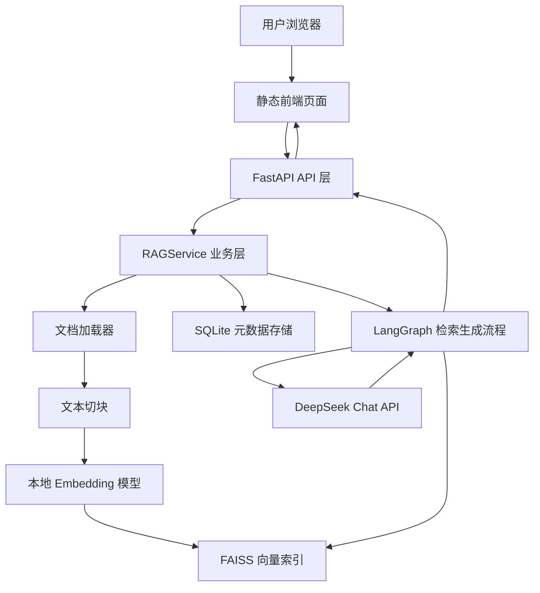

# RAG 文档问答系统

一个面向本地文档问答场景的 RAG Demo。系统支持上传 PDF / Markdown 文档，将文档切块后写入本地向量索引，并通过 DeepSeek 生成基于文档证据的回答。

## 功能特性

- 支持 PDF / Markdown 文档上传
- 基于 `sentence-transformers` 的本地 Embedding
- 基于 FAISS 的本地向量检索
- 基于 SQLite 的文档元数据、文档块映射和聊天记录存储
- 基于 DeepSeek OpenAI-compatible API 的回答生成
- 支持引用来源展示
- 支持删除文档并同步移除对应向量
- 支持选中文档后优先在当前文档内问答
- 提供 Windows 本地启动脚本 `start.ps1`

## Quick Start

### 1. 创建虚拟环境

```powershell
python -m venv .venv
```

### 2. 安装依赖

```powershell
.\.venv\Scripts\python.exe -m pip install -r requirements.txt
```

### 3. 配置环境变量

复制 `.env.example` 为 `.env`，填写 DeepSeek API Key：

```env
DEEPSEEK_API_KEY=sk-your-key
DEEPSEEK_API_BASE=https://api.deepseek.com
DEEPSEEK_MODEL_NAME=deepseek-chat
EMBEDDING_MODEL=all-MiniLM-L6-v2
VECTOR_STORE_PATH=./vector_store
INDEX_FILE=index.faiss
METADATA_FILE=index.pkl
RETRIEVAL_SCORE_THRESHOLD=1.35
TOP_K=8
```

### 4. 启动服务

Windows 本地推荐使用：

```powershell
.\start.ps1
```

默认访问地址：

```text
http://127.0.0.1:8001/
```

API 文档地址：

```text
http://127.0.0.1:8001/docs
```

健康检查：

```text
http://127.0.0.1:8001/api/v1/health
```

### 5. 使用流程

1. 打开 `http://127.0.0.1:8001/`
2. 上传 PDF 或 Markdown 文档
3. 点击“处理文档”
4. 在右侧输入问题
5. 查看回答和引用来源

## 系统架构



## 数据更新机制

### 上传文档

用户上传文档后，系统执行以下流程：

1. 根据文件类型选择加载器，支持 PDF 和 Markdown
2. 将原始文档切分为多个 chunk
3. 为每个 chunk 写入 `doc_id`、`chunk_id`、`source`、`page` 等元数据
4. 使用本地 Embedding 模型生成向量
5. 将向量写入 FAISS，并持久化到 `vector_store/index.faiss` 和 `vector_store/index.pkl`
6. 将文档记录和 chunk 映射写入 SQLite 的 `app.db`

### 提问检索

用户提问后，系统执行以下流程：

1. 对问题做查询扩展和检索准备
2. 在 FAISS 中检索相似文档块
3. 如果前端选中了某个文档，则只保留该文档对应的 chunk
4. 对候选 chunk 做轻量重排和过滤
5. 将命中的上下文发送给 DeepSeek
6. 返回回答和引用来源

### 删除文档

删除文档时，系统会同时更新 SQLite 和 FAISS：

1. 根据 `doc_id` 查找文档记录
2. 从 FAISS 中移除该文档对应的 chunk
3. 重新构建并保存剩余向量索引
4. 从 SQLite 中删除文档记录和 chunk 映射

这可以避免“前端看起来删了，但向量库里仍然能搜到”的问题。

### 聊天记录

聊天记录保存在 SQLite 的 `chat_messages` 表中。清空聊天只影响聊天记录，不会删除文档和向量索引。

## 存储结构

运行时数据位于 `vector_store/`：

```text
vector_store/
  app.db
  index.faiss
  index.pkl
  legacy_backup/
  .gitkeep
```

说明：

- `app.db`：SQLite 数据库，保存文档元数据、chunk 映射和聊天记录
- `index.faiss`：FAISS 向量索引
- `index.pkl`：FAISS 文档元数据
- `legacy_backup/`：旧 JSON 数据迁移后的备份目录
- `.gitkeep`：用于保留空目录

这些运行时数据不会提交到 GitHub。

## API 概览

### 健康检查

```http
GET /api/v1/health
```

### 上传文档

```http
POST /api/v1/upload
Content-Type: multipart/form-data
```

### 文档列表

```http
GET /api/v1/documents
```

### 提问

```http
POST /api/v1/ask
Content-Type: application/json
```

请求体：

```json
{
  "question": "这份文档的主要结论是什么？",
  "document_id": "doc_0_20260424120000"
}
```

`document_id` 可选。传入后，系统会优先在指定文档范围内检索。

### 总结文档

```http
GET /api/v1/documents/{doc_id}/summary
```

### 删除文档

```http
DELETE /api/v1/documents/{doc_id}
```

### 聊天记录

```http
GET /api/v1/chat/all
DELETE /api/v1/chat
```

## Docker 运行

构建镜像：

```powershell
docker build -t rag-system .
```

使用 Compose 启动：

```powershell
docker compose up --build
```

如果使用 Docker，请以 `docker-compose.yml` 中暴露的端口为准。

## 测试

运行全部单元测试：

```powershell
.\.venv\Scripts\python.exe -m unittest discover -s tests -p "test_*.py" -v
```

测试临时文件会写入 `tests/.tmp/`，避免依赖系统临时目录权限。

## 已知限制

- 当前是单机本地 Demo，不包含用户体系和权限控制
- 多轮对话上下文仍较弱，聊天记录目前主要用于展示和留存
- 检索重排是轻量规则，不是独立 reranker 模型
- 首次加载本地 Embedding 模型可能较慢
- 回答质量依赖上传文档质量和 DeepSeek API 可用性

## 后续改进方向

- 增加 Query Rewrite 节点
- 引入专用 reranker 模型
- 增强多轮对话上下文
- 增加 GitHub Actions 自动测试
- 增加一键清空知识库和重建索引脚本
